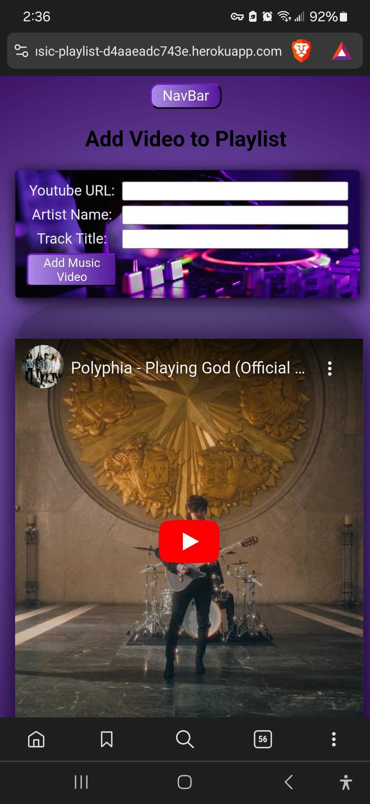

# Music-Playlist 🎧
This is an app that I made because I love music and thought it would be a cool thing to have users add music videos they like and be able to share those with others instead of having to scroll through their history on Youtube. This allows the user to add an embedded link, putting the artist and track title. 

# Screenshots

# Technologies Used

- JavaScript
- HTML
- CSS
- React
- Express
- Node.js
- Pixabay for the images
- Illustrator -> for the favicon
- Favicon Generator
- Heroku
- Mongoose
- MongoDB

# Getting Started

[Click to View Project Planning](https://trello.com/b/dX62z3ab/project3-music)
[Click to View Music-Playlist!🎧](https://music-playlist-d4aaeadc743e.herokuapp.com/)

# Next Steps

- Add a QR-Code to scan on your playlist
- Add a search functionality
- Add Genre Selection
- Add the ability to edit your playlist
- Add an auto-cycle feature to the video carousel